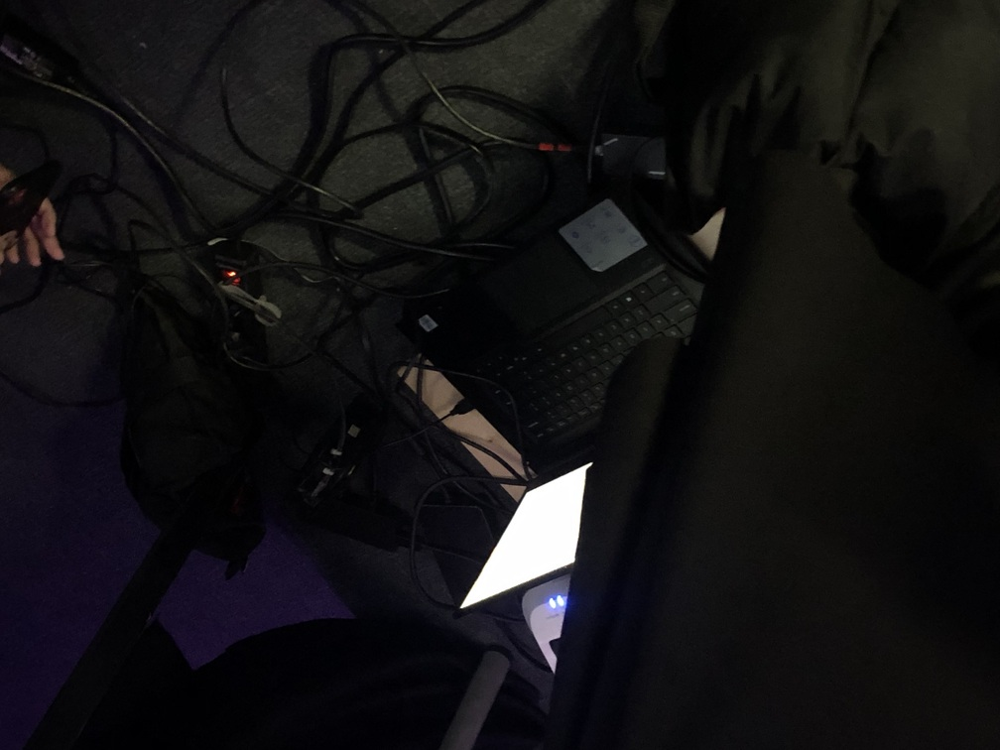

## Titre 
Canevas cosmique
## Personne de l'équipe
- Jacob Alarie-Brousseau
- Étienne Charron
- Jérémy Cholette
- Quoc Huy Do
- Mikaël Tourangeau
## Lien avec Crecentia
Le lien entre Crecentia et le project Canevas cosmique car Crecentia représente le concept de l'évolution et l'évolution a plusieurs facette et Canevas cosmique représente l'évolution du systeme solaire à cause des actions de l'utilisateur

## Instalation

## Schéma

