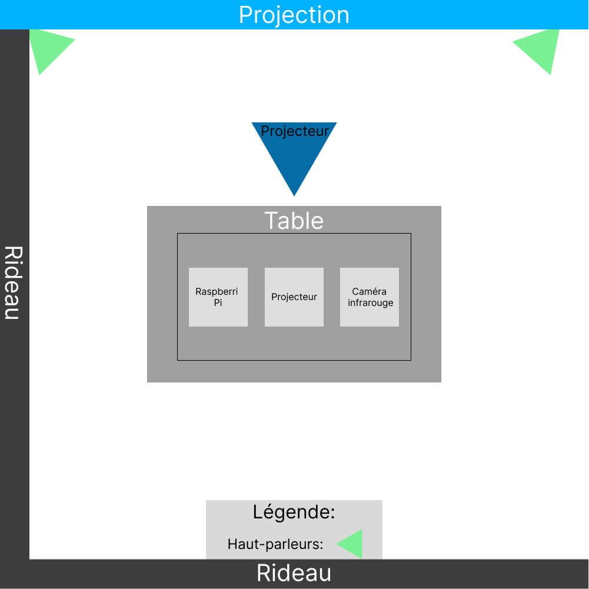

## Titre 
Canevas cosmique
## Personne de l'équipe
- Jacob Alarie-Brousseau
- Étienne Charron
- Jérémy Cholette
- Quoc Huy Do
- Mikaël Tourangeau
## Lien avec Crecentia
Le lien entre Crecentia et le project Canevas cosmique car Crecentia represente le concept de l'evolution et l'evolution a plusieurs facette et Canevas cosmique represente l'evolution du systeme solaire a cause des actions de l'utilisateur

## Instalation

## Schéma

