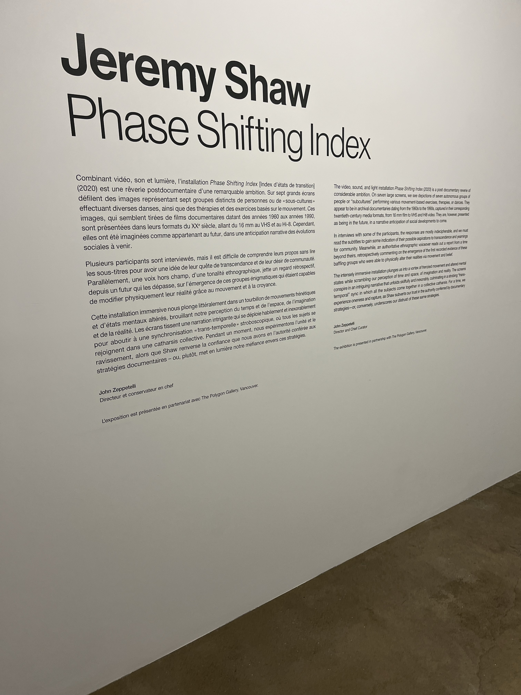

Nom de l'expposition
Jeremy Shaw Phase shifting index

Lieu de mise en exposition 
Fonderie darling

Type d'exposition
temporaire, ittineraire

Date de votre visite
31 Janvier 2024

Titre de l'oeuvre
Phase shifting index

Nom de l'artiste
Jeremy Shaw

Année de realisation
En 2020

Description de l'oeuvre
Vaste installation video immersive à sept canaux, Phase Shifting Index [Index d’états de transition] est une reverie parascientifique exaltante d’une grande ambition intellectuelle et artistique, et le point culminant des travaux recents de Shaw. Dans ce qui semble etre une étude anthropologique d’un futur lointain, une narration commente de maniere retrospective l’emergence de nouvelles realites déconcertantes sur sept ecrans affichant ce qui s’avere etre des images d’archives de divers groupes de therapie par le mouvement des annees 60 aux années 90. Ces images sont captees dans les formats de l’époque – allant du film 16 mm au VHS en passant par le Hi-8. Source pris du site : https://macm.org/expositions/jeremy-shaw/

Type d'installation
Immersive

Mise en espace
Il y a 7 ecrans certains suspendu du plafond d'autres sur des murs, la salle est couvert de tapis gris et il y a des haut-parleurs dans la piece

Componsant et technique
L'oeuvre se compose de projecteurs et des 7 ecrans et des lumieres qui ajoutent a l'ambiance

Element necessaire a la mise en exposition 
Des tapis utiliser dans toute la piece, des estrades pour s'assoir

Experience vecue
L'oeuvre ma fait ressentir un amusement avec certains des pieces de certains ecrans, cela ma aussi rendu confu quand les ecrans/personnages se fusionnaient entre eux et finalement une joie/admirartion quand j'ai vue les couleurs hyptonique 

Ce qui vous a plut, vous a donne des idees
Certaines scenes etaient interessant et la partie avec plusieurs couleurs est definitivement ma section prefere

Aspect que vous ne souhaiteriez pas retenir pour vos propres créations ou que vous feriez autrement
Je ne voudrais pas retenir la partie ou les personnages se melangeaient entre eux et la visibiliter etait super reduite
