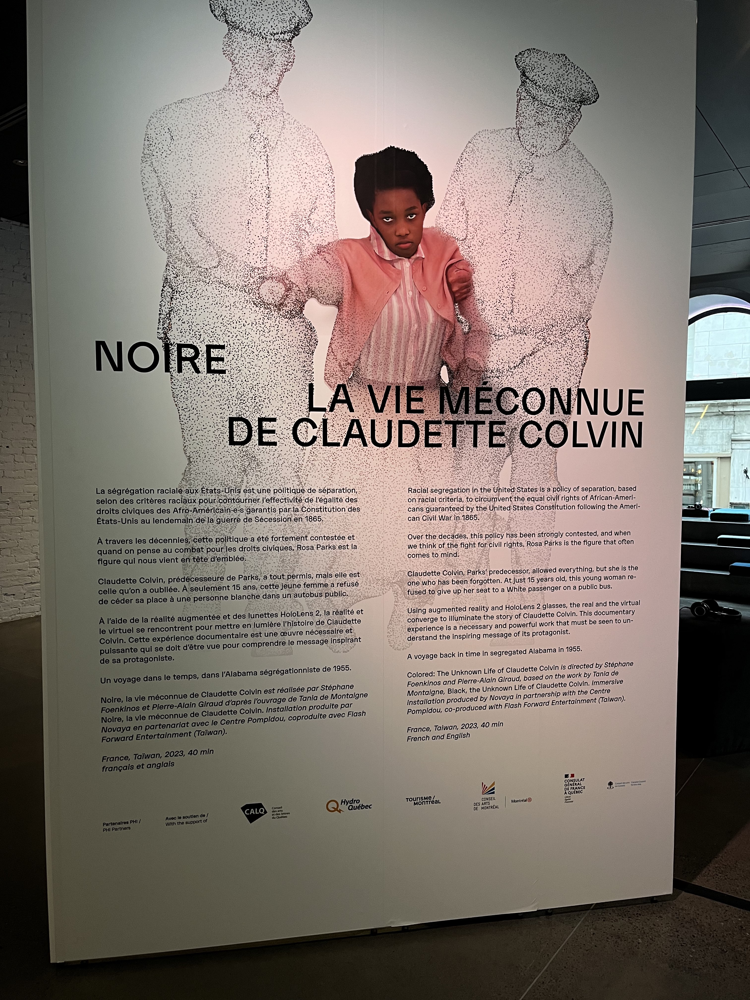
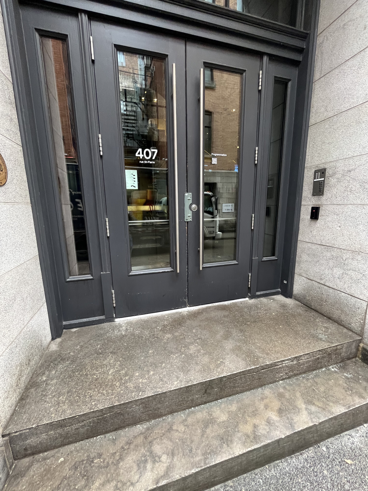
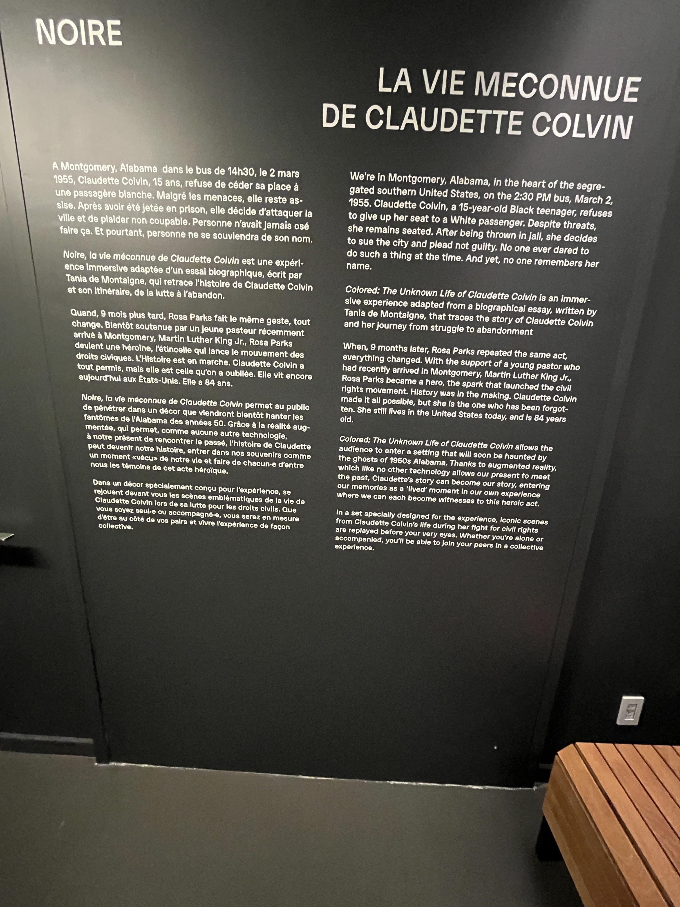
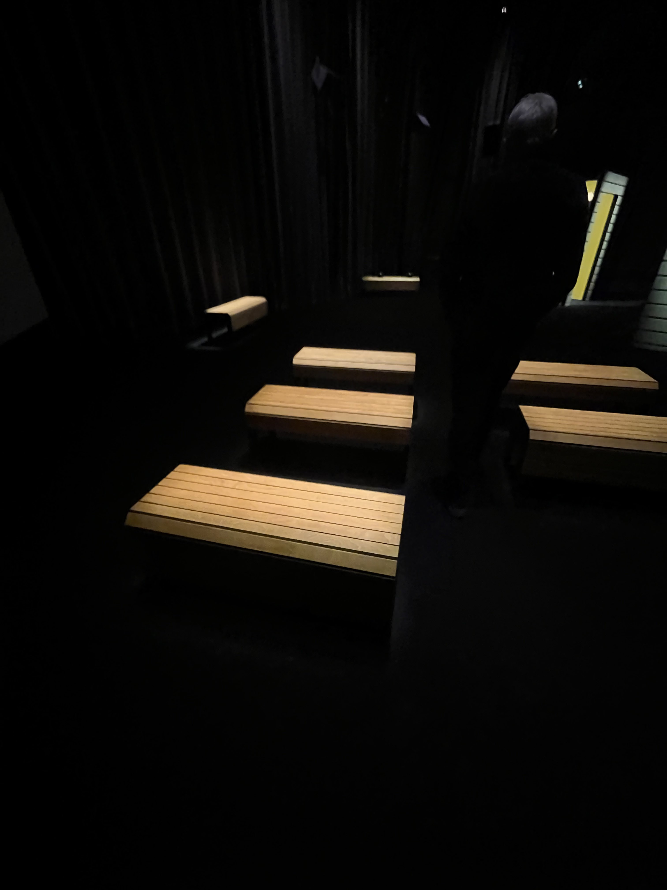
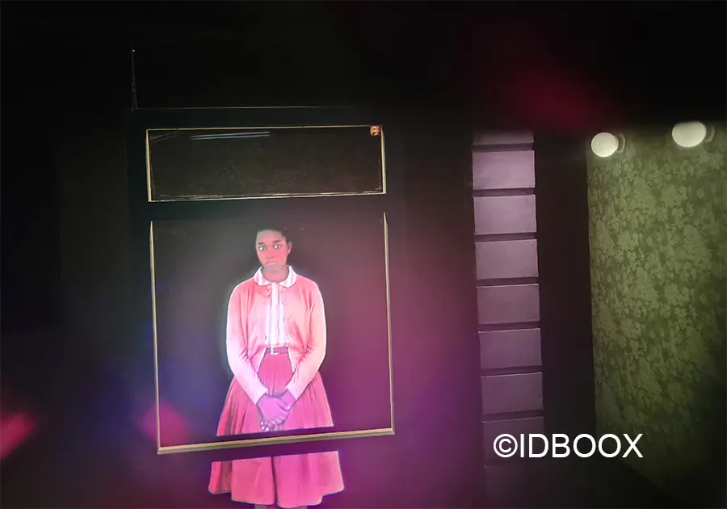
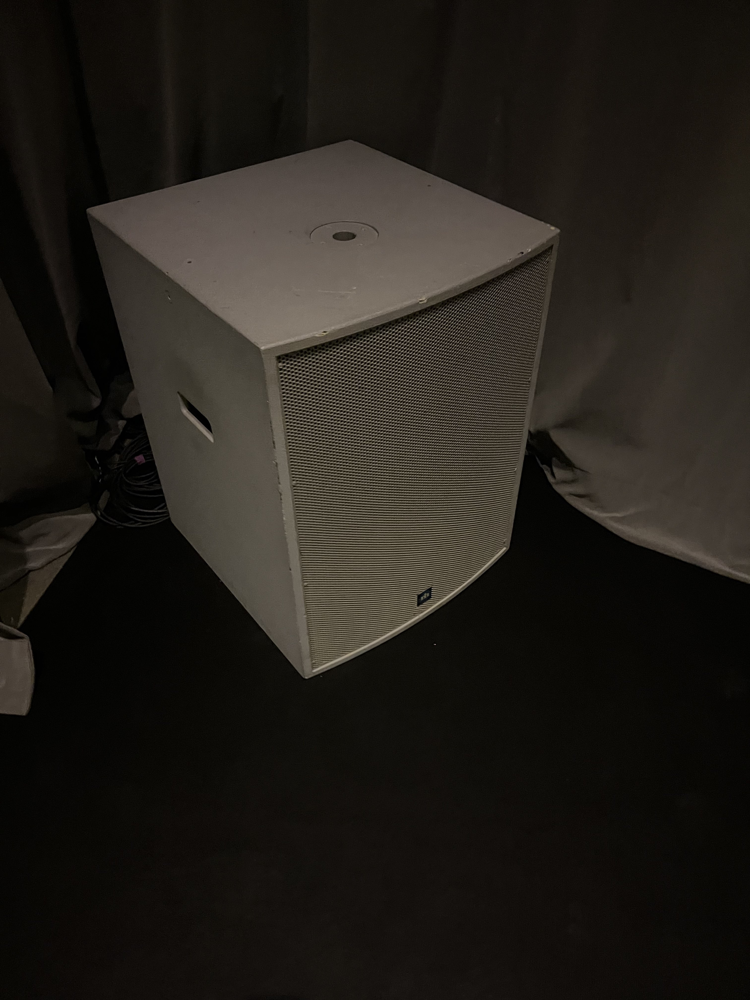
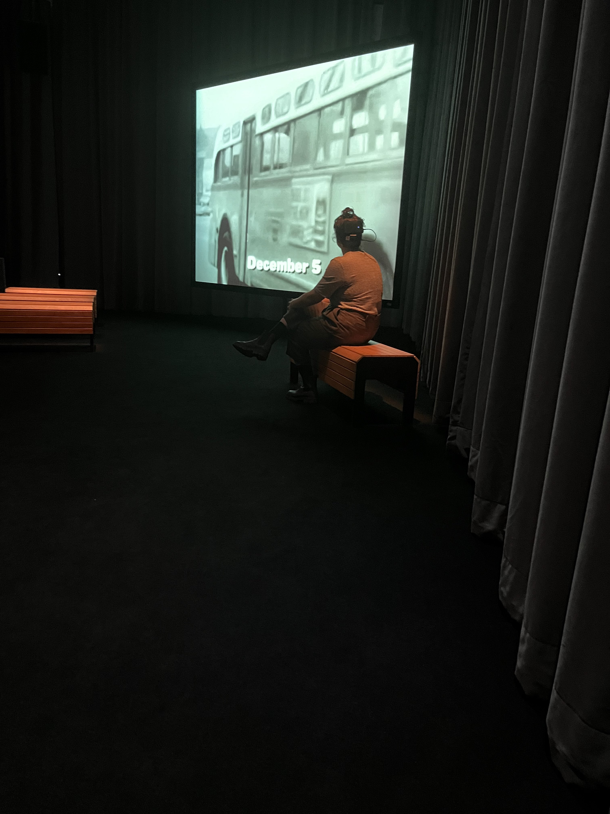
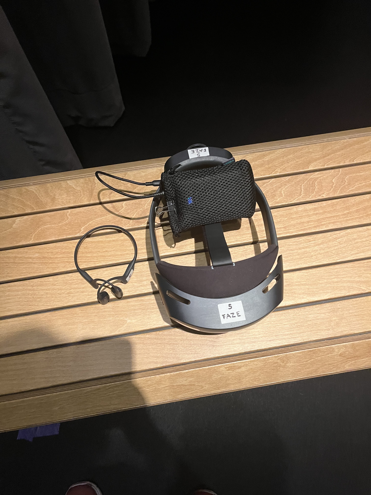
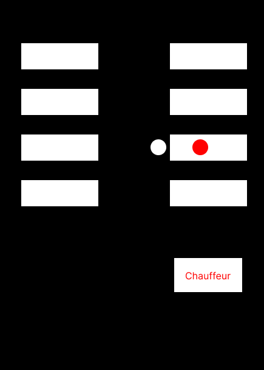
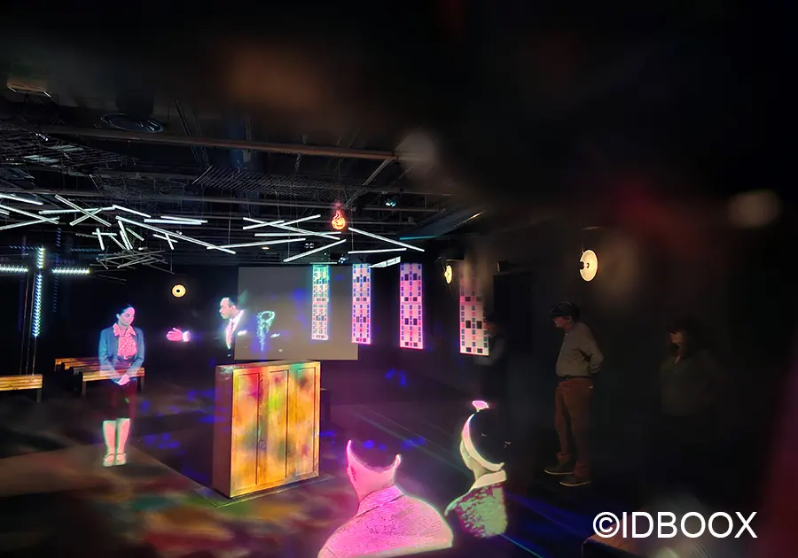

# Nom de l'exposition
Noire, la vie méconnue de Claudette Colvin

## Lieu de mise en exposition 
Centre PHI, Centre Pompidou (fini)

## Type d'exposition
Ittinérante, temporaire

## Date de votre visite
28 Février 2024

## Titre de l'oeuvre
Noire, la vie méconnue de Claudette Colvin

## Nom de l'artiste
- Novaya
- Réalisateur : Stéphane Foenkinos et Pierre-Alain Giraud

## Année de realisation
2019

## Description de l'oeuvre
Noire, la vie méconnue de Claudette Colvin est une expérience immersive adaptée d'un essai biographique, écrit par Tania de Montaigne, qui retrace l’histoire de Claudette Colvin et son itinéraire de la lutte à l’abandon. 

## Type d'installation
Immersive

## Mise en espace
On était amenner dans une grande salle (de 200 a 500 m2). Il y avait des bancs de bois, un écran et un projecteur, il y avait aussi une structure qui représentait la prison.

## Componsante et technique
Un fichier numérique avec de la réalite augmenter et une expérience sensoriel à travers des haut-parleur et des écouteurs et des videos étanent projeter sur un écran.

Hologramme <https://www.idboox.com/culture/noire-la-decouverte-extraordinaire-de-la-vie-de-claudette-colvin-en-realite-augmentee/>

Haut parleur

Écran

## Element necessaire a la mise en exposition 
Il devait avoir les écouteurs qu'on mettait derriere nos oreille, il devait avoir aussi des lunnetes AR (HoloLens2) qui nous permettaient de voir l'histoire de Claudette grâce à des hologrammes

HoloLens et écouteurs

Scène de bus

Scène de procès <https://www.idboox.com/culture/noire-la-decouverte-extraordinaire-de-la-vie-de-claudette-colvin-en-realite-augmentee/>

## Experience vecue
J'ai eu une belle expérience, je l'ai trouver fascinante et l'utilisation de la réaliter augmenter était incroyable et cela m'as permit d'apprendre l'histoire de Claudette Colvin

## Ce qui vous a plut, vous a donne des idees
J'ai trouver que la réalité augmentée à bien été utilisée, les animations étaient fluide, je trouve qu'utiliser la réaliter augmenter est un très bon choix en multimédia

## Aspect que vous ne souhaiteriez pas retenir pour vos propres créations ou que vous feriez autrement
Je trouve que le projecteur était pas assez utiliser à mon gout et n'avait pas vraiment de coherence à part pour une scène. Je trouve que ça aurait été meilleur si il n'avait pas utiliser l'écran et aurait juste utilise la réaliter augmenter
