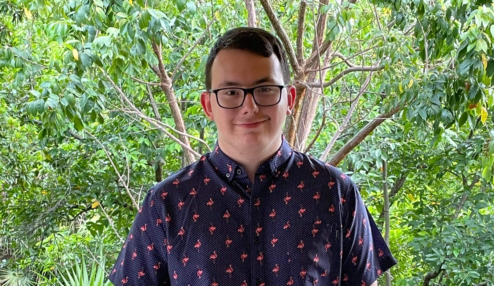

Yannick Chamberland

Intérêts dans le multimédia 
Je suis passionné par l'animation 2d et 3d, j'aime aussi la modélisation et les arts numériques. Je compte apprendre et m'améliorer et transformer ces passions en métiers.

Ce qui me plait dans l'animation et le dessin
L'animation est un moyen de s'exprimer ou de réaliser des cours/longs métrages, transformer ses imaginations en réalisation. Le dessin permet de donner vie à toutes les idées qu'on peut avoir.
